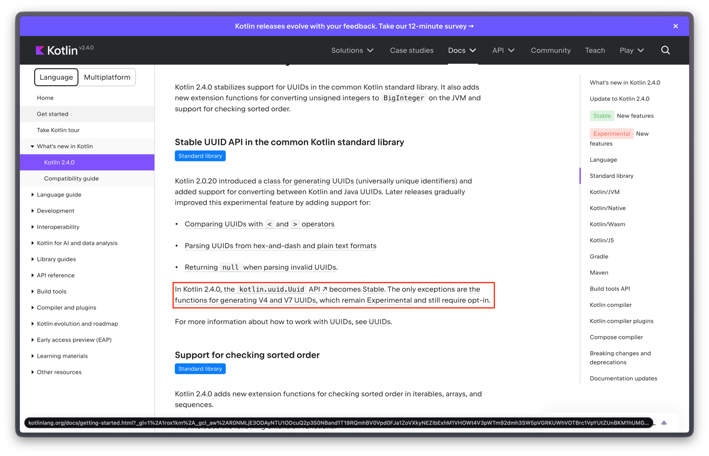

- 데이터베이스에 저장하는 고유 식별키(PK) 에서 어떤 값들을 사용하는지 알아보다가, 오토 인크리먼트, 시퀀스, UUID, snowflake 알게 되었다.
  java 환경에는 아직 공식적으로 여러 UUID 등을 지원하지 않는 것 같은데, 코틀린 2.0.20 부터 표준 라이브러리에 Uuid 가 도입됏음.

마침 프로젝트에서 써볼까 하고 kotlin 2.3.21 에서 v7 써보려고 했는데, 실험적인 기능이어서 @OptIn(kotlin.uuid.ExperimentalUuidApi::class) 를 붙여 컴파일 경고를
피해야했다.

매번 UUID 라이브러리 만들거나, 검증되지 않은 누군가 만들어놓은거 가져오기가 조금 그랬음.. (표준적으로 제공 안되니..? ㄸㄹ.ㄹ..)

kotlin 2.3.0 부터는 v4, v7 에 대해 공식 생성 메서드를 제공! 근데 아직 실험적이더라..
아! Uuid.random() 은 참고로 v4 를 생성하기 때문에 이거 쓰면됩니다.(이름이 v4인게 명확하긴 하지만..)

근데 마침 오늘 아침에 코틀린 2.4.0 공식 release 발표를 보게됐고, 항목에 Uuid 표준라이브 러리 안정화! 보고 들어가보게 됐음.

https://blog.jetbrains.com/kotlin/2026/06/kotlin-2-4-0-released/

`Standard library: Stabilized support for the UUID API and support for checking sorted order.`

https://kotlinlang.org/docs/whatsnew24.html?_cl=MTsxOzE7MU5Kb0Q3VXd1bWdqR1lzcTd0cTBmNzl3UmxoSGJraUo1TXluaE5sVWc5OUN0ZHNKbnNCUEFEa0g4b0lNRWZhNjs%3D#standard-library



아직 v4, v7 생성 메서드에 대한 안정화는 도지 않았나보다.

### UUID v7 알아보기

# UUIDv7, 원리부터 장단점까지 — 그리고 Kotlin 2.3 표준 라이브러리 구현 뜯어보기

Kotlin 2.3.0부터 표준 라이브러리가 `Uuid.generateV4()`와 `Uuid.generateV7()`를 제공한다. 별도 라이브러리(`uuid-creator`, `kotlinx-uuid` 등) 없이,
멀티플랫폼에서 동일한 API로 v7 UUID를 만들 수 있게 됐다. (단, UUID API는 아직 Experimental이라 `@OptIn(ExperimentalUuidApi::class)`가 필요하다.)

그런데 v7이 정확히 뭐고, 왜 v4 대신 굳이 v7을 쓰는 흐름이 생겼을까? 원리부터 장단점, 그리고 Kotlin 표준 라이브러리가 이걸 어떻게 구현했는지까지 정리해 본다.

## 먼저, UUID와 버전 이야기

UUID는 128비트(16바이트) 식별자다. 중앙 조정자 없이 어디서든 독립적으로 만들어도 충돌 확률이 극히 낮다는 게 핵심 장점이다. 형식은 RFC 9562(2024년에 기존 RFC 4122를 대체)에 정의돼
있고, 버전 비트로 생성 방식을 구분한다.

- **v1**: 타임스탬프 + MAC 주소 기반. 시간순이긴 하지만 MAC 주소가 노출되고, 바이트 배치가 시간순 정렬에 적합하지 않다.
- **v4**: 거의 전부 랜덤(122비트). 가장 널리 쓰이지만 **정렬 불가능**하다. 만든 순서와 값의 대소 관계가 무관하다.
- **v7**: Unix epoch 밀리초 타임스탬프를 맨 앞에 두고, 나머지를 랜덤으로 채운다. **시간순으로 정렬 가능**하면서 v4 수준의 유일성을 유지한다.

v7의 등장 배경을 한 문장으로 요약하면 이렇다. **"v4의 분산 생성·유일성은 그대로 가져가되, 정렬 불가능 때문에 생기는 데이터베이스 인덱스 문제를 해결하자."**

## UUIDv7의 비트 구조

128비트가 어떻게 나뉘는지가 v7의 전부라고 해도 과언이 아니다.

```
 0                   1                   2                   3
 0 1 2 3 4 5 6 7 8 9 0 1 2 3 4 5 6 7 8 9 0 1 2 3 4 5 6 7 8 9 0 1
+---------------------------------------------------------------+
|                          unix_ts_ms                           |  48비트 타임스탬프(상위)
+-------------------------------+-------+-----------------------+
|          unix_ts_ms           |  ver  |        rand_a         |  ver=4비트(0111), rand_a=12비트
+---+---------------------------+-------+-----------------------+
|var|                         rand_b                            |  var=2비트(10), rand_b=62비트
+---+-----------------------------------------------------------+
|                            rand_b                             |
+---------------------------------------------------------------+
```

정리하면:

| 필드           | 비트 | 내용                             |
|--------------|----|--------------------------------|
| `unix_ts_ms` | 48 | Unix epoch 기준 밀리초 타임스탬프 (빅엔디안) |
| `ver`        | 4  | 버전. v7이면 `0111`                |
| `rand_a`     | 12 | 랜덤. 또는 같은 ms 내 순서 보장용 카운터로 활용  |
| `var`        | 2  | variant. 항상 `10`               |
| `rand_b`     | 62 | 랜덤                             |

핵심은 **타임스탬프가 맨 앞 48비트**에 온다는 점이다. UUID를 문자열이나 바이트로 정렬하면 곧 생성 시각순 정렬이 된다. 이걸 "k-sortable(거의 정렬된)"이라고 부른다.

## 왜 "정렬 가능"이 그렇게 중요한가 — 데이터베이스 인덱스

v7의 모든 장점은 사실상 이 한 가지에서 파생된다. 데이터베이스의 기본 인덱스(B-Tree/B+Tree)와 클러스터형 인덱스(예: MySQL InnoDB의 PK)를 떠올려 보자.

- **v4(랜덤) PK**: 새 레코드가 인덱스의 *아무 데나* 꽂힌다. 중간 페이지에 끼워 넣어야 하니 페이지 분할(page split)과 단편화가 잦고, 캐시에 없는 페이지를 계속 디스크에서 읽어 와야 한다.
  데이터가 커질수록 INSERT가 느려진다.
- **v7(시간순) PK**: 새 값이 항상 인덱스의 *오른쪽 끝 근처*에 붙는다. 순차 삽입에 가까우니 페이지 분할이 적고, 최근 페이지가 캐시에 머무를 확률이 높다. 대량 INSERT 성능과 인덱스 밀도가
  좋아진다.

즉 v7은 "auto-increment 정수 PK의 인덱스 친화성"과 "UUID의 분산 생성·유일성"을 절충한 물건이다.

## Kotlin 표준 라이브러리 구현 뜯어보기

이제 실제 `UuidV7Generator.generate(clock)` 코드를 보자. 단순히 "타임스탬프 + 랜덤"을 붙이는 게 아니라, **같은 밀리초 안에서도 순서를 보장**하기 위해 꽤 영리한 장치가 들어
있다.

```kotlin
fun generate(clock: Clock): Uuid {
    // rand_b(62비트)와 카운터 시드로 쓸 랜덤 10바이트
    val randomBytes = ByteArray(10).also { secureRandomBytes(it) }

    // 12비트 rand_a 중 최상위 1비트는 비워 두고(0x07 마스크 → 11비트),
    // 그 자리에 카운터 시드를 넣은 뒤 버전 비트(0111)를 합친다.
    val newCounter = randomBytes[8].toInt().and(0x07).shl(8)
        .or(randomBytes[9].toInt().and(0xFF))
        .or(VERSION_MASK)

    var newTimeStampAndCounter: Long
    while (true) {
        val previousTimeStampAndCounter = timestampAndCounter.load()
        val currentTimeMillis = clock.now().toEpochMilliseconds()
        val previousTimeMillis = previousTimeStampAndCounter.ushr(TIMESTAMP_BIAS_BITS)

        if (previousTimeMillis < currentTimeMillis) { // 시계가 흘렀다
            newTimeStampAndCounter =
                currentTimeMillis.shl(TIMESTAMP_BIAS_BITS).or(newCounter.toLong())
            if (timestampAndCounter.compareAndSet(previousTimeStampAndCounter, newTimeStampAndCounter)) break
        } else { // 같은 ms이거나 시계가 뒤로 갔다
            newTimeStampAndCounter = previousTimeStampAndCounter + 1 // 카운터 증가
            if (newTimeStampAndCounter.and(OVERFLOW_MASK) != 0L) {   // 카운터 오버플로
                // 타임스탬프 +1ms 하고 카운터 재시드
                newTimeStampAndCounter =
                    (previousTimeMillis + 1L).shl(TIMESTAMP_BIAS_BITS).or(newCounter.toLong())
            }
            if (timestampAndCounter.compareAndSet(previousTimeStampAndCounter, newTimeStampAndCounter)) break
        }
    }

    // variant(10) 세팅 후 rand_b 완성
    randomBytes[0] = randomBytes[0].and(0x3F).or(0x80.toByte())
    val variantAndRandB = randomBytes.getLongAt(0)
    return Uuid.fromLongs(newTimeStampAndCounter, variantAndRandB)
}
```

### 1) 상위 64비트를 하나의 Long에 묶는다

`timestampAndCounter`는 `AtomicLong`이다. 여기엔 UUID의 **상위 64비트**, 즉 `[48비트 타임스탬프][4비트 버전][12비트 rand_a/카운터]`가 통째로 들어간다.
`TIMESTAMP_BIAS_BITS`는 16이다(타임스탬프 아래에 버전 4 + rand_a 12 = 16비트가 있으므로). 그래서 `currentTimeMillis.shl(16)`이 타임스탬프를 상위 48비트로
올리고, 하위 16비트에 버전·카운터가 들어간다.

### 2) CAS 루프로 락 없이 단조 증가 보장

`while(true)` + `compareAndSet`은 전형적인 **무잠금(lock-free) CAS 루프**다. 여러 스레드가 동시에 호출해도, "이전 값이 그대로면 새 값으로 바꾼다"를 성공할 때까지
재시도하므로 락 없이 thread-safe하다. 그 결과 한 프로세스 안에서 생성된 UUID는 호출 순서대로 **엄격히 증가**한다.

### 3) 같은 ms 안에서의 순서 — 12비트 카운터

시계가 아직 다음 밀리초로 넘어가지 않았다면(`else` 분기) 타임스탬프를 그대로 두고 `+1`만 한다. 이 `+1`이 곧 `rand_a`(12비트) 자리의 카운터 증가다. 그래서 같은 밀리초에 만들어진
UUID들도 만든 순서대로 정렬된다. RFC 9562 §6.2의 "Fixed Bit-Length Dedicated Counter" 방식이다.

여기서 카운터 시드를 12비트가 아니라 11비트만 채운 점(`and(0x07)` → bits 0~10)이 중요하다. 12비트 `rand_a`의 시작값을 항상 하위 절반(`0x000`~`0x7FF`)에 두는 것인데,
덕분에 어떤 랜덤 시드가 나와도 그 밀리초 안에서 최소 2048번(최대 4096번)은 카운터를 올릴 여유가 생긴다. 원문 주석의 'moderate optimism'이 이 얘기다.

### 4) 카운터 오버플로 — 1ms 빌려오기

상수를 보면 이 설계가 어떻게 맞물리는지 드러난다.

```kotlin
private const val TIMESTAMP_BIAS_BITS = 16   // 타임스탬프 아래 ver(4)+rand_a(12)
private const val VERSION_MASK = 0x7000      // ver=0111을 bits 12~15에 박음
private const val OVERFLOW_MASK = 0x8000L    // 카운터 최상위 비트가 1이면 오버플로
```

버전을 `0x7000`으로 세팅하면 상위 64비트의 하위 16비트는 `[0111(ver)][12비트 rand_a]` 형태가 되고, 이때 bit 15는 0이다. 카운터를 `+1` 하다 보면 `[ver|rand_a]`가
하나의 수처럼 올라가는데, `rand_a`가 `0xFFF`를 다 채운 다음 한 번 더 증가하면 값이 `0x7FFF` → `0x8000`이 되며 bit 15가 1로 바뀐다. 즉 **"rand_a 12비트가 꽉 찼다"
와 "버전 자리가 망가지기 직전"이 정확히 같은 사건**이고, 이를 `and(OVERFLOW_MASK) != 0` 한 번으로 잡아낸다. (그래서 카운터의 유효 범위가 딱 12비트, 한 ms당 4096개다.)

오버플로가 잡히면 타임스탬프를 1ms 앞당기고 카운터를 재시드한다. 미래의 1ms를 미리 당겨 쓰는 셈이라, 한 밀리초에 4096개를 초과해 발급해도 단조성이 깨지지 않는다. 대신 이런 폭주 상황에선 타임스탬프가
실제 시각보다 살짝 앞설 수 있다.

### 5) 시계가 뒤로 가도 안전하다

NTP 보정 등으로 시계가 거꾸로 가면 `currentTimeMillis < previousTimeMillis`가 되어 `else` 분기로 빠진다. 여기서는 이전 값에서 `+1`만 하므로, 새 값이 절대 이전 값보다
작아지지 않는다. **시계가 뒤로 가도 UUID는 계속 증가**한다.

### 6) 하위 64비트 — variant와 rand_b

마지막으로 `randomBytes[0]`의 최상위 2비트를 지우고 `0b10`으로 세팅해 variant를 박은 뒤, 8바이트(62비트 rand_b + 2비트 variant)를 하위 64비트로 쓴다.
`Uuid.fromLongs(상위, 하위)`로 128비트를 완성한다.

## 장점

- **데이터베이스 인덱스 친화적**: 시간순 삽입 → 페이지 분할/단편화 감소, 캐시 적중률 상승, 대량 INSERT 성능 향상. 특히 클러스터형 인덱스 PK에서 v4 대비 차이가 크다.
- **분산 생성 + 유일성**: auto-increment처럼 중앙 조정이 필요 없다. 여러 서버·서비스가 독립적으로 발급해도 충돌 확률이 사실상 없다.
- **시간 정보 내장**: 별도 `created_at` 없이도 ms 단위 생성 시각을 대략 알 수 있고, 시간 범위 조회·정렬에 유리하다.
- **v1의 단점 제거**: MAC 주소를 노출하지 않고, Unix epoch ms라는 단순한 시간 표현을 쓴다.
- **표준 + 광범위한 지원**: RFC 9562 표준이며, 이제 Kotlin 표준 라이브러리를 비롯해 여러 언어·DB가 기본 지원한다.

## 단점과 주의점

- **생성 시각이 노출된다**: 앞 48비트가 곧 타임스탬프다. UUID만 봐도 "이 레코드가 언제 만들어졌는지" 추정할 수 있다. 가입 시각, 주문 시각 등을 숨겨야 하는 곳엔 부적합하다. 외부 노출 식별자로 쓸
  땐 정보 누출을 반드시 고려해야 한다.
- **예측 가능성이 v4보다 높다**: 랜덤 비트가 v4(122비트)보다 적고(rand_b 62비트 + rand_a 일부), 앞부분은 시간이라 추측 가능하다. 추측 불가능성이 보안 요건인 토큰 용도로는 v4가
  낫다.
- **단조성 보장 범위가 좁다**: Kotlin 구현의 엄격한 단조 증가는 **한 프로세스(애플리케이션 생명주기) 안에서만** 보장된다. 서로 다른 프로세스·호스트에서 같은 ms에 만든 UUID 사이의 순서는
  보장되지 않으며, 호스트 간 시계 오차가 있으면 전역 정렬은 어긋날 수 있다.
- **저장 비용**: 16바이트로, 4~8바이트짜리 정수 PK보다 인덱스·메모리를 더 먹는다. 최고 성능이 필요한 곳에선 여전히 bigint auto-increment가 유리할 수 있다.
- **문자열 표현이 길다**: 36자(하이픈 포함). URL·로그에서 길고, 더 짧은 식별자가 필요하면 별도 인코딩을 고려해야 한다.
- **ms 단위 한계**: 같은 ms에 한 프로세스가 4096개를 넘기면 미래 ms를 당겨 쓴다. 극단적 발급률에선 타임스탬프가 실제 시각보다 조금 앞설 수 있다.
- **시스템 클록 의존**: 구현이 역행을 잘 막아 주긴 하지만, 근본적으로 시계에 의존하는 식별자라는 점은 인지하고 있어야 한다.

## 언제 쓰면 좋은가

- **데이터베이스 PK로 UUID를 쓰고 싶을 때**: v4 PK의 인덱스 성능 문제를 겪고 있다면 v7이 직접적인 해법이다.
- **분산 환경에서 시간순 정렬이 필요한 식별자**: 이벤트 로그, 메시지 ID, 주문 번호 등.
- 반대로 **추측 불가능성·시각 비노출이 중요한 외부 토큰**이라면 v4(또는 별도 불투명 토큰)를 쓰는 게 맞다.

참고로 v7과 비슷한 시간정렬 식별자로 ULID가 있는데, v7은 그 아이디어를 RFC로 표준화한 버전이라고 보면 된다. 표준·호환성 측면에서 새 프로젝트라면 v7이 무난하다.

## Kotlin에서 쓰는 법

```kotlin
import kotlin.uuid.Uuid
import kotlin.uuid.ExperimentalUuidApi

@OptIn(ExperimentalUuidApi::class)
fun main() {
    val a = Uuid.generateV7()
    val b = Uuid.generateV7()
    val c = Uuid.generateV7()

    println(a < b) // true
    println(b < c) // true  — 같은 ms여도 카운터 덕분에 순서 보장
}
```

특정 시각의 v7이 필요하면 `Uuid.generateV7NonMonotonicAt(instant)`를 쓸 수 있다(이름 그대로 단조성은 보장하지 않는다). 랜덤 부분은 플랫폼의 CSPRNG로 만들어지며, 시스템
엔트로피가 부족하면 잠깐 블로킹될 수 있다는 점도 알아 두면 좋다. (Kotlin/Wasm-WASI 타깃의 난수는 암호학적 안전성이 보장되지 않으니 주의.)

## 마무리

UUIDv7은 "랜덤 UUID의 장점은 유지하되, 정렬 불가능 때문에 생기던 DB 인덱스 문제를 타임스탬프 prefix로 푼다"는 한 문장으로 정리된다. Kotlin 2.3 표준 구현은 여기에 더해 12비트
카운터 + 무잠금 CAS 루프로 한 프로세스 내 엄격한 순서까지 보장한다. 다만 생성 시각이 노출되고 v4보다 예측 가능성이 높다는 트레이드오프가 있으니, "내부 PK·정렬용이면 v7, 외부 비밀 토큰이면 v4"라는
기준으로 골라 쓰면 된다.

